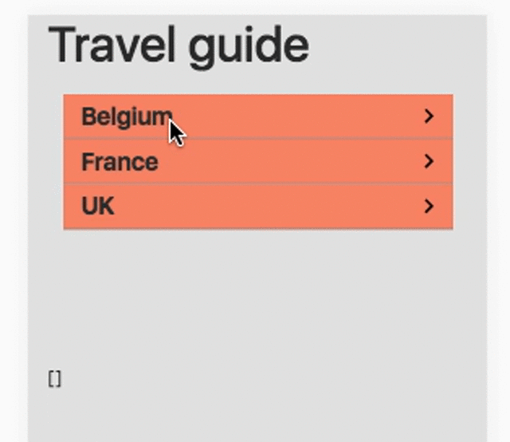

# Elm Sliding Menu

An Elm library for nested menus for mobile-first websites.

## Demo



## Installation

    elm-package install simonh1000/elm-sliding-menus

## Setup

```elm
import SlidingMenu

type alias Model =
    { menu : SlidingMenu.Model
    , userMessage : List String
    }

-- UPDATE

type Msg
    = MenuMsg SlidingMenu.Msg -- a message to relay SlidingMenu messages


myUpdateConfig : SlidingMenu.UpdateConfig
myUpdateConfig =
    { menu = menu
    , easing = Nothing -- using default easing
    }

-- Handle the 3-tuple return value from SlidingMenu.update
update : Msg -> Model -> ( Model, Cmd Msg )
update message model =
    case message of
        MenuMsg msg ->
            let
                ( mm, cmd, maybeList ) =
                    SlidingMenu.update myUpdateConfig msg model.menu

                newModel =
                    { model
                        | menu = mm
                        , userMessage =
                            maybeList |> Maybe.withDefault model.userMessage
                    }
            in
                ( newModel, Cmd.map MenuMsg cmd )

-- VIEW

myViewConfig : SlidingMenu.ViewConfig
myViewConfig =
    { menu = menu
    , back = "Back"
    }

view : Model -> Html Msg
view model =
    div [ class "container" ]
        [ SlidingMenu.view myViewConfig model.menu |> Html.map MenuMsg
        , div [] [ text <| toString model.userMessage ]
        ]

-- Some data to use

menu : List SlidingMenu.MenuItem
menu =
    let categories =
        [ SlidingMenu.leaf "Food", SlidingMenu.leaf "Hotels", SlidingMenu.leaf "Bars" ]
    in
    [ SlidingMenu.node "Belgium" categories
    , SlidingMenu.node "France" categories
    , SlidingMenu.node "UK" categories
    ]
```
